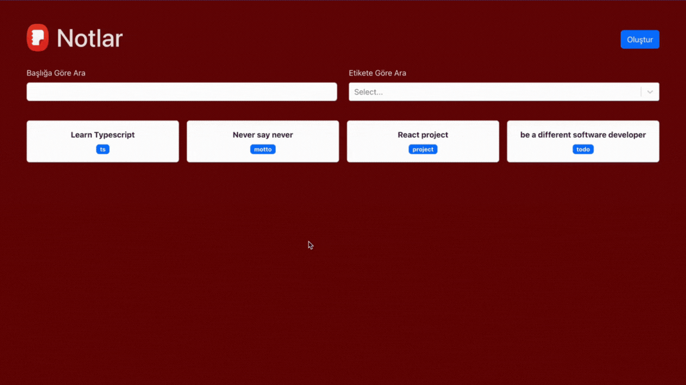

# notesApp

This project, developed with TypeScript, is a note-taking application that allows you to add, delete, and edit notes with Markdown support. Additionally, you can list and filter your notes by title or tag name.

## Libraries

- typescript
- react-bootstrap
- react-router-dom
- uuid
- bootstrap
- react-select
- react-markdown

## GIF

